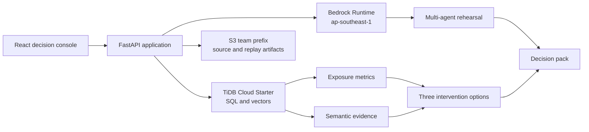

# Histórico — plano inicial do Horizon 90

> Este documento registra uma proposta inicial com Bedrock, S3 e EC2. Ela foi **substituída** pela implementação local com TiDB, TiDB Vector, OpenAI Responses/GPT-5.6 Luna e registro local. Para avaliação, consulte [README](../../../README.md), [EVALUATION](../../../EVALUATION.md), [SUBMISSION](../../../SUBMISSION.md) e [`.kiro/specs/horizon-90/`](../../../.kiro/specs/horizon-90/).

# Horizon 90: Airport Digital Rehearsal - Design (histórico)

## Status

Revised MVP approved for implementation on 2026-09-02.

## Product decision

Horizon 90 is a generative-AI decision rehearsal for airport disruption scenarios. It is not a flight-delay predictor and does not perform rebooking. An operator describes a hypothetical event, the system measures the exposed operation, simulates stakeholder responses to three possible interventions, and creates an evidence-backed decision pack for human review.

The audience is the airport or airline operations duty manager deciding how to respond in the next 90 minutes.

## Goals

- Turn a natural-language disruption scenario into explicit, reviewable assumptions.
- Quantify the scenario's exposure from structured data when available.
- Retrieve semantically similar policies, incident notes, and prior decision packs from TiDB.
- Compare three fixed interventions through a lightweight multi-agent stakeholder rehearsal.
- Produce a concise decision pack with evidence, risks, trade-offs, and follow-up questions.
- Demonstrate TiDB Cloud, TiDB Vector Search, Amazon Bedrock, S3, EC2 deployment, and Kiro specifications.

## Non-goals and claims boundary

- No assertion of live operational data, real-world prediction, booking changes, or autonomous customer contact.
- No display of passenger names, passports, addresses, emails, phone numbers, employee data, or raw personal data.
- No dependency on Amazon Bedrock Agents, Lambda, SQS, OpenSearch, Transcribe, Cognito, or other AWS services not supplied by the event.
- No claim of a MiroFish integration unless an actual, externally executed MiroFish report is imported and visibly attributed.

## Confirmed operating constraints

- AWS console, EC2, and S3 run in `sa-east-1`; Bedrock calls use `ap-southeast-1`.
- The provided Bedrock bearer token supports direct model invocation. Use only the announced model IDs.
- EC2 is a `t3.micro` with 913 MB RAM and no swap. The deployed app must stay lightweight.
- S3 access is restricted to the team's prefix.
- Public application ports are 3000 and 8000-8999. The process must bind to `0.0.0.0`.
- TiDB Cloud Starter is the persistent store and has a public TLS endpoint.
- The `airportdb` dataset is optional. When used, it supplies a simulation baseline, not ground truth about a current airport.
- The deployed process is one lightweight FastAPI application serving static HTML, CSS, and JavaScript. No Node runtime is required on EC2.

## Core workflow

1. The operator starts from the seeded GRU capacity-reduction case or fills a structured scenario form. Natural language may prefill the form, but the operator confirms location, time window, duration, and capacity reduction before a run.
2. Bedrock converts the optional free-text description to a scenario contract, with any missing values kept explicit rather than invented.
3. The API queries TiDB for affected planned flights, booking counts, and aircraft capacity. Weather is not joined unless a verified mapping between station and airport is supplied. If no matching data exists, it uses an explicitly marked seeded demo scenario.
4. TiDB Vector Search retrieves relevant operational notes and policy chunks.
5. The app generates three intervention options with deterministic exposure metrics plus AI-written rationale.
6. A lightweight multi-agent rehearsal runs one round for four named stakeholder roles. Each role receives only aggregate, scenario-specific context and has a defined objective. Role requests run concurrently and return a short structured response.
7. Bedrock Haiku performs scenario extraction and the role rehearsal. Bedrock Sonnet is called only after the operator requests the final evidence-backed decision pack. The operator selects an option but no external action occurs.
8. The source packet and decision-pack JSON are stored under the team S3 prefix; metadata, citations, and summaries remain in TiDB.

## MiroFish relationship

The primary mode is `lightweight_multi_agent`. It is inspired by MiroFish's pattern of actors, incentives, memories, interaction rounds, and a structured report, but it is implemented inside the app using Bedrock and TiDB. It must be labeled exactly as "multi-agent rehearsal inspired by MiroFish" and never as an integrated MiroFish runtime.

An optional `imported_mirofish` mode accepts a MiroFish report generated outside the EC2 instance. It stores the original report in S3, preserves provider and run identifiers in TiDB, and labels its evidence as "MiroFish report". Full MiroFish is not deployed as part of the MVP because it requires its own LLM-compatible configuration and Zep Cloud key, while the hackathon EC2 is memory constrained.

## Architecture

### Application components

| Component | Responsibility |
|---|---|
| Static console | Scenario composer, exposure view, strategy comparison, stakeholder reactions, and final decision pack, served by FastAPI. |
| FastAPI application | Validates requests, serves the console, orchestrates database retrieval, Bedrock calls, one multi-agent round, and artifact writes. |
| TiDB Cloud Starter | Stores scenario state, aggregate exposure, policies, evidence chunks, simulation reactions, and decision-pack metadata. |
| TiDB auto-embedding | Generates and searches vectors for notes and policy chunks using `EMBED_TEXT`. |
| Bedrock Haiku | Fast extraction, role responses, and structured intermediate results. |
| Bedrock Sonnet | Final decision-pack synthesis only. |
| S3 | Immutable original source packet, optional imported MiroFish report, and replayable result JSON. |
| EC2 | Hosts the static frontend and API process. |

## Data model

| Table | Purpose |
|---|---|
| `scenarios` | Scenario text, parsed contract, simulation mode, creation time, and assumptions. |
| `scenario_exposure` | Aggregate counts by route, time window, airline, and risk class. No personal data. |
| `evidence_chunks` | Policy or incident text, source metadata, S3 key, and generated `VECTOR(1024)` embedding. |
| `intervention_options` | Three strategies, deterministic metrics, rationale, and constraints. |
| `simulation_runs` | Mode, actors, rounds, model metadata, timing, and warnings. |
| `agent_reactions` | Role, round, response, pressure signal, and cited evidence IDs. |
| `decision_packs` | Final recommendation, trade-offs, evidence IDs, S3 replay key, and human-selected option. |

`airportdb` is queried read-only. Only aggregate counts and route-level facts cross into the app-specific tables.

## Stakeholder simulation

The four fixed roles are: passenger with a short connection, airline operations center, airport duty manager, and customer-service leader.

Each role has:

- one stated objective;
- constraints derived from the scenario contract;
- aggregate exposure metrics;
- retrieved evidence snippets;
- one short response round; and
- a structured output containing likely reaction, objection, pressure signal, and validation question.

The system does not impersonate real people or infer facts about actual passengers.

## UX and demo path

1. **Scenario composer**: choose the seeded scenario or complete location, time, duration, and capacity fields. Free text is optional and must be confirmed.
2. **Scenario contract**: review the parsed time, location, event, and assumptions before running.
3. **Exposure board**: show affected flights, passengers as aggregates, and evidence retrieved from TiDB.
4. **Strategy board**: compare exactly three responses with clear trade-offs.
5. **Rehearsal view**: show the six actors' pressure signals across two rounds.
6. **Decision pack**: choose a response and export/save the evidence-backed replay.

The two-minute demonstration uses a seeded GRU capacity-reduction case. The app attempts the real TiDB, vector, Bedrock, and S3 paths first. A clearly labelled cached visual fallback is available only if an external service fails during the demonstration.

## Error handling and fallbacks

- Run preflight tests before the demo: TiDB TLS query, vector query, Bedrock Haiku call in Singapore, and S3 write/read in the team prefix.
- If Bedrock is unavailable, render exposure metrics and pre-seeded strategy text, clearly labelled "AI synthesis unavailable".
- If TiDB is unavailable, allow only the seeded local demo payload and label it "local demo fallback".
- If S3 write fails, keep the decision pack in TiDB and show that the external replay was not archived.
- If an imported MiroFish report is absent or invalid, hide the imported mode rather than fabricating its output.
- Batch model calls and use short, structured prompts. Never call Bedrock once per flight, passenger, or row.

## Security and privacy

- `.env` stays untracked. Commit only `.env.example`.
- The public app exposes no credentials, raw S3 contents, or passenger/staff PII.
- Bedrock prompts contain only aggregates, route identifiers, event facts, and curated policy/evidence excerpts.
- User-provided source files are scoped to the team's S3 prefix and are never committed.

## Verification

- Unit tests cover scenario-contract validation, deterministic exposure calculations, redaction, fixed strategy ordering, and role prompt composition.
- Integration checks cover TiDB TLS connection, vector retrieval, Bedrock invocation in Singapore, and S3 team-prefix write.
- Browser checks cover the end-to-end seeded scenario, decision selection, and responsive layout.
- The repository will include `SUBMISSION.md`, `.kiro/` specifications, `.env.example`, source paths for TiDB/vector/Bedrock calls, and clear labels for all demo or fallback states.

## Success criteria

- A user can run one seeded scenario end to end in under two minutes.
- Every decision-pack claim links to an exposure metric, evidence chunk, or explicit simulation assumption.
- The repo can evidence TiDB Cloud, TiDB Vector Search, Bedrock, EC2 deployment, and Kiro usage without secrets.
- No UI or prompt path exposes raw personal information.

## Source references

- https://github.com/henriqueleandro-arch/LatamHackathon
- https://raw.githubusercontent.com/henriqueleandro-arch/LatamHackathon/main/PARTICIPANT-GUIDE.md
- https://github.com/666ghj/MiroFish
